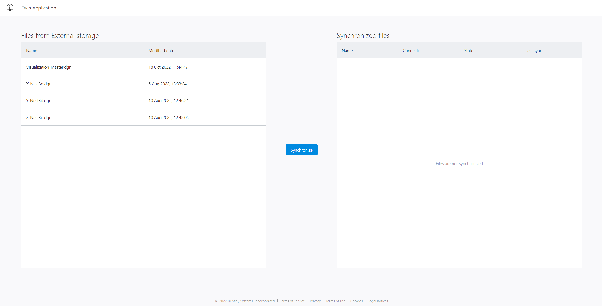
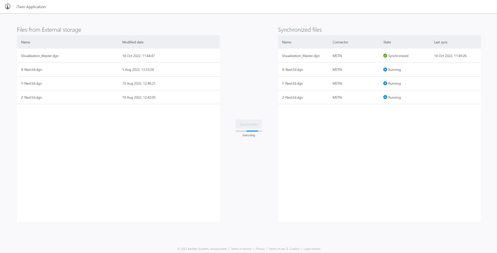
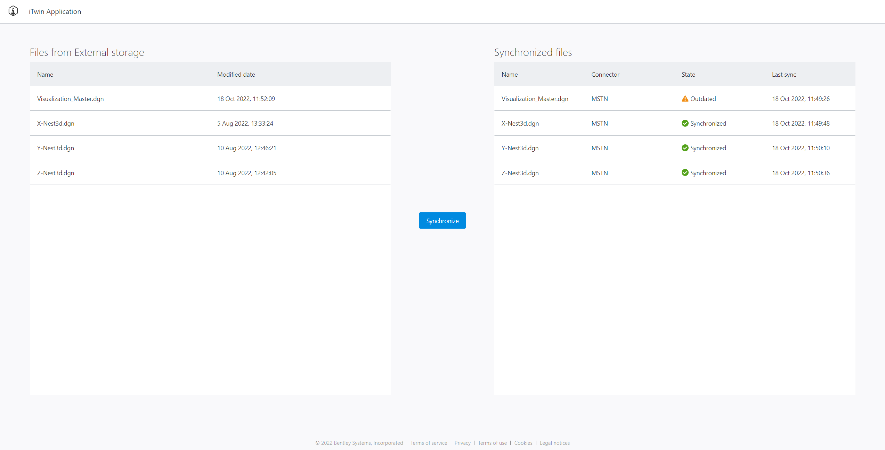
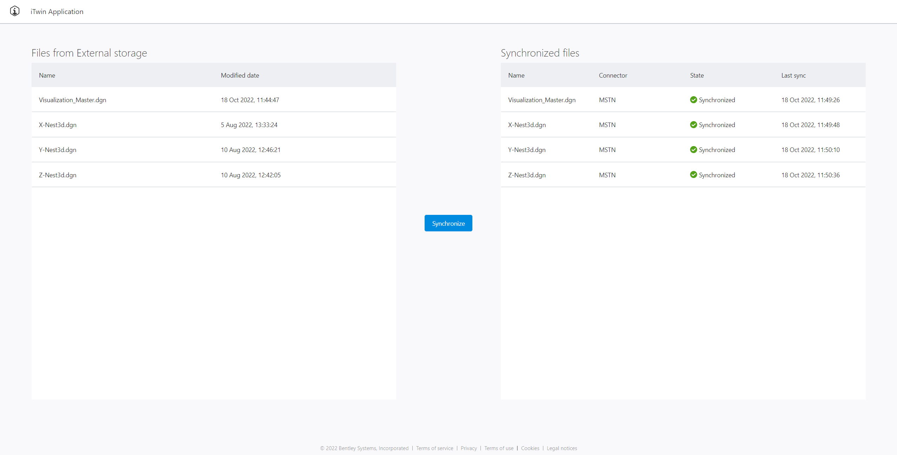

# Synchronization Manifest API sample

This is a sample application that demonstrates the usage of [Manifest Connection](https://developer.bentley.com/apis/synchronization/operations/get-manifest-connection/). This application implements external storage files synchronization using Manifest Connection API operations with the presentational result. The supported storage types: Azure blob, Sharepoint.

## Prerequisites

- [Git](https://git-scm.com/)
- [TypeScript](https://www.typescriptlang.org/)
- [Node](https://nodejs.org/en/): an installation of the latest security patch of Node 16. The Node installation also includes the **npm** package manager.
- [Visual Studio Code](https://code.visualstudio.com/): an optional dependency, but the repository structure is optimized for its use.

## Setup

Please make sure to follow these steps for running this code sample application:

1.  Clone this repository.
1.  Create an [empty iModel](https://developer.bentley.com/my-imodels/). Note down context(project) and iModel IDs.
1.  `.env` file is required for setting up environmental variables used by the server application. Create `.env` file at `./ExternalStorageDrive` and fill out required environmental variables.

    With Azure blob storage setup the .env file contents should contain:

    ```
    CONTAINER_NAME = <container name>                  // `CONTAINER_NAME` is your newly created container name inside Azure Blob storage, example: test
    CONNECTION_STRING = <connection string>            // `CONNECTION_STRING` is your Azure Storage account connection string, fake example: DefaultEndpointsProtocol=http;AccountName=devstoreaccount1;AccountKey=Eby8vdM02xNOcqFlqUwJPLlmEtl6IFsuFq2UVErCz4I6tq/K1SZFPTOtr/KBHBeksoGMGw==;
    STORAGE_TYPE = Azure                               // Standard for all Azure blob storages
    ```

    Read more about the configuration of Azure Storage connection strings in the official [documentation](https://docs.microsoft.com/en-us/azure/storage/common/storage-configure-connection-string).

    With SharePoint storage setup the .env file contents should contain:

    ```
    CLIENT_ID = <client id>                            // `CLIENT_ID` is the unique identifier of an application created in Active Directory
    TENANT_ID = <tenant id>                            // Your Microsoft 365 `TENANT_ID` is a globally unique identifier (GUID) that is different than your organization name or domain
    CLIENT_SECRET = <client secret>                    // `CLIENT_SECRET` is the password of the service principal
    AAD_ENDPOINT = https://login.microsoftonline.com/  // Standard for all SharePoint storages
    GRAPH_ENDPOINT = https://graph.microsoft.com/      // Standard for all SharePoint storages
    STORAGE_TYPE = SharePoint                          // Standard for all SharePoint storages
    ```

    Create a new application secret:

    1. Select Azure Active Directory.
    1. From App registrations in Azure AD, select your application.
    1. Select Certificates & secrets.
    1. Select Client secrets -> New client secret.
    1. Provide a description of the secret, and a duration. When done, select Add.

1.  `.env` file is required for setting up environmental variables used by a portal application. Create `.env` file at `./Portal` and fill out required environmental variables.

    The file contents should contain:

    ```
    REACT_APP_PROJECT_ID = <Project ID>                // `REACT_APP_PROJECT_ID` is your created Context(Project) ID.
    REACT_APP_IMODEL_ID = <iModel ID>                  // `REACT_APP_IMODEL_ID` is your created iModel's ID.
    REACT_APP_CLIENT_ID = <client ID>                  // `REACT_APP_CLIENT_ID` is your [registered application's](https://developer.bentley.com/my-apps/) Client ID.
    ```

    Registered application's:

    - Scopes: `imodels:modify`, `imodels:read`, `synchronization:modify`, `synchronization:read`.
    - Redirect Urls: `http://localhost:3000/silent-signin-oidc`, `http://localhost:3000/signin-oidc`, `http://localhost:3000/`.
    - Post Logout Urls: `http://localhost:3000/signout-oidc`

1.  Open two terminal tabs.
1.  In first terminal tab navigate to `./ExternalStorageDrive`.
1.  Run `yarn` to install the required dependencies.
1.  Run `yarn run build` to build the code.
1.  Run `yarn run start` to start the server.
1.  In the second terminal tab navigate to `./Portal`.
1.  Run `yarn` to install the required dependencies.
1.  Run `yarn run start` to start the portal.
1.  Navigate to localhost:3000 (default port) in your browser.

## Code overview

Code is documented to help user understand how data is being used from each API call, how authorization workflow is implemented, what is the purpose of each page and some other minor details.

We encourage user to understand how OAuth2 authorization workflow is implemented. In this code sample, authentication flow implementation details can be found at src/auth files.

src/components is where most of the application logic is written. Component namings are self-explanatory, refer to each for further explanations of each API call and how the data is used.

## Code sample introduction

Code is documented to help the user understand how data is being used from each API call, how authorization workflow is implemented, what is the purpose of the main page and some other minor details.

[App.tsx](./Portal/src/App.tsx) contains a general navigation scheme.

[auth](./Portal/src/auth) folder contains all OAuth2 authorization workflow implementation.

[components](./Portal/src/components) folder contains most of application logic. Component namings are self-explanatory.

[services](./Portal/src/services) folder contains external storage files retrieval API usage and Manifest API functionality. Refer to each for further explanations of each API call and how the data is used.

[index.ts](./ExternalStorageDrive/index.ts) contains all server logic needed for external files retrieval.

## Application overview

### Starting state

State representing files from selected storage type in the 'Files from External storage' area without synchronization results in the 'Synchronized Files' area.


### Synchronizing state

State representing files from selected storage type in the 'Files from External storage' area with synchronization progress in the 'Synchronized Files' area.


### Outdated state

When one of the files is updated in selected storage the file state changes to 'outdated' in the the 'Synchronized Files' area.


### Synchronized state

State representing files from selected storage type in the 'Files from External storage' area with synchronization results in the 'Synchronized Files' area.


## Introduction to application workflow

1.  Upload selected files to the supported storage.
1.  Authenticate.
1.  Two tables will be present - one for external files information, other for synchronized files information.
1.  Press 'Synchronize' button.
1.  When the synchronization is done 'Synchronize' button will become active again.
1.  Synchronized files table has updated information.

## Useful tips

1. If you have a corrupted connection or you want to have a new connection - change the name of 'connectionName' property in `./Portal/src/setup.ts` to the new value.
1. Create free trial account for SharePoint: https://www.microsoft.com/en-us/microsoft-365/enterprise/office-365-e3?activetab=pivot%3aoverviewtab
